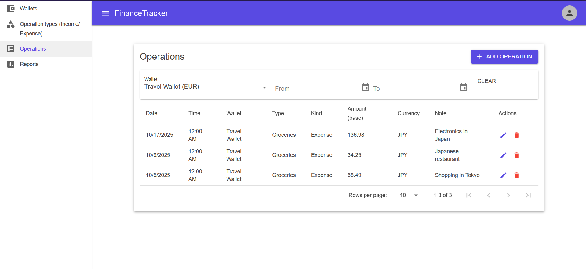
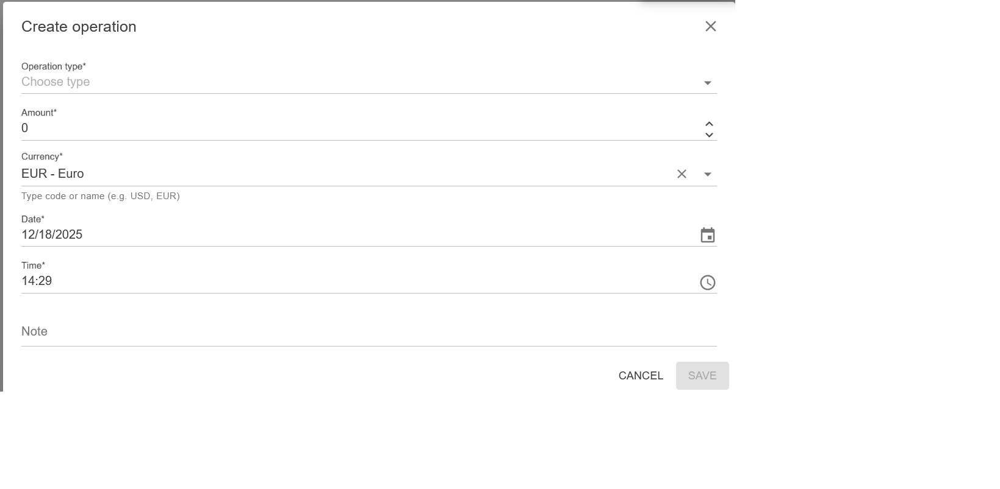
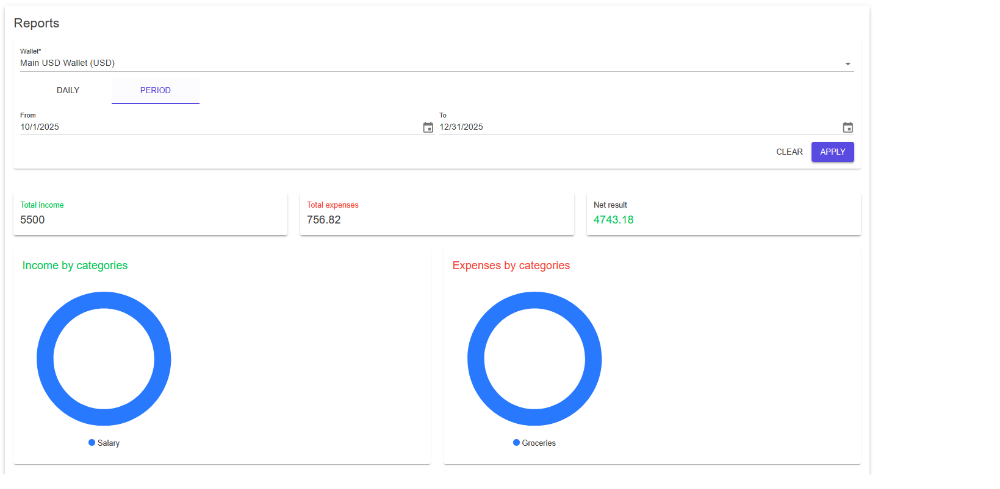
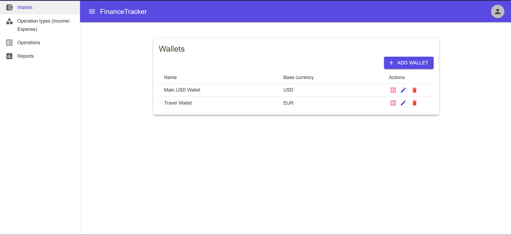

# Personal Finance Manager

## Overview

A personal finance management application consisting of two parts:
- **Backend** – ASP.NET Core Web API for managing financial data
- **Frontend** – ASP.NET Core Blazor UI using MudBlazor

## Live demo

**Railway:** <https://financetracker-blazorui.up.railway.app>

**Default credentials:**
- Username: `admin`
- Password: `admin`

## Technologies

### Backend
- ASP.NET Core Web API
- Entity Framework Core
- PostgreSQL
- JWT authentication
- Docker & Docker Compose

### Frontend
- ASP.NET Core Blazor (WebAssembly)
- MudBlazor component library
- Responsive layout

## Key Features

### Financial Management
- **Operation Types** – full CRUD for income and expense categories (Salary, Rent, Food, etc.)
- **Financial Operations** – create, edit, view, and soft delete transactions
- **Wallets** – ability to create separate wallets for each user with base currency
- **Currency Conversion** – automatic exchange rate calculation for transaction date

### Reports
- **Daily Report** – total income, expenses, net result, and operation list for selected date
- **Period Report** – same information for date range

### Security and Audit
- **Authentication** – user system with JWT tokens (default admin/admin)
- **Logging** – middleware for logging all requests and responses with ability to track request sequences for different users

## Screenshots

### Financial Operations




### Reports


### Wallet Management


## How to Run
```bash
docker compose up -d
```

After startup:
- Swagger UI: http://localhost:8080/swagger
- Blazor client: http://localhost:8081

